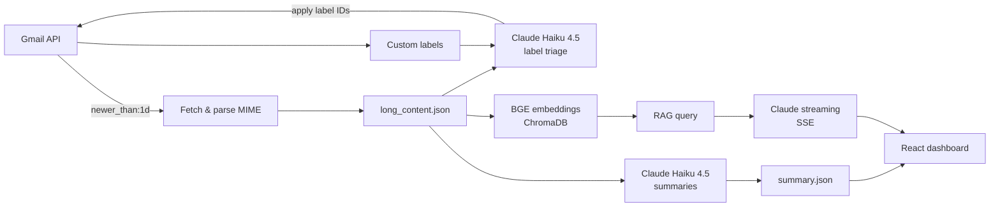

# 📬 Gmail Triage & RAG Copilot

A personal AI assistant that triages my Gmail inbox every morning and lets me ask questions about my recent emails in plain English.

Every day at 8:00 AM, it fetches the last 24 hours of mail, applies my own custom Gmail labels using Claude, writes a short actionable summary of each email, and serves everything as a daily brief on a React dashboard. A RAG copilot then lets me ask follow-up questions ("Did anyone send me an invoice?", "What deadlines do I have this week?") and streams back answers grounded in my actual emails.

---

## ✨ Features

- **Automatic labeling** – Classifies each email into your existing custom Gmail labels (system labels are filtered out) and applies them directly in Gmail.
- **Daily summaries** – Generates a 1–3 sentence summary per email that captures asks, deadlines, amounts, and action items.
- **RAG copilot** – Semantic search over your recent emails with ChromaDB and BGE embeddings, with answers streamed from Claude via Server-Sent Events.
- **Voice output** – The dashboard can read copilot answers aloud with text-to-speech.
- **Hands-free scheduling** – Runs automatically every morning through a macOS `launchd` agent.
- **Batched, structured LLM calls** – Emails are processed in batches of 15, and the model is held to a strict JSON schema so its output can be applied back to Gmail without manual cleanup.

---

## 🏗️ Architecture



**Pipeline stages**

1. **Fetch** – Pulls emails from the last 24 hours using Gmail's native query syntax (`q="newer_than:1d"`), decodes the base64 MIME payloads with Python's `email` library, and extracts the sender, subject, snippet, and body text.
2. **Label** – Retrieves your custom Gmail labels and sends them, together with the emails, to Claude Haiku 4.5. The model returns a label ID per message, and the backend applies each one through the Gmail API.
3. **Summarize** – Sends the same emails to Claude Haiku 4.5 with an executive-assistant prompt and writes the summaries to `summary.json`.
4. **Ask** – Indexes the emails in ChromaDB, retrieves the top matches for a question, and streams Claude's grounded answer back to the frontend.

The triage run is currently orchestrated by a Claude tool-calling agent (see [Lessons learned](#-lessons-learned) for why this is changing).

---

## 🧰 Tech Stack

| Layer | Tools |
|---|---|
| Backend | Python, FastAPI |
| Email | Gmail API, Google OAuth 2.0 |
| LLMs | Anthropic Claude API (Haiku 4.5 for triage, summaries, and RAG answers; Sonnet for agent orchestration) |
| Retrieval | ChromaDB, Sentence Transformers (`BAAI/bge-base-en-v1.5`), cosine similarity |
| Streaming | Server-Sent Events |
| Frontend | React, TypeScript, Tailwind CSS (generated with Claude) |
| Scheduling | macOS `launchd` |

---

## 📁 Project Structure

```
.
├── main.py              # FastAPI app, Gmail integration, labeling, summaries, agent loop
├── rag.py               # Email indexing (ChromaDB) and streaming RAG queries
├── credentials.json     # Google OAuth client secrets (not committed)
├── token.json           # Generated OAuth token (not committed)
├── .env                 # ANTHROPIC_API_KEY (not committed)
└── chroma_db/           # Local vector store (generated)
```

Generated at runtime:

| File | Contents |
|---|---|
| `long_content.json` | Full parsed emails from the last 24 hours |
| `short.json` | Lightweight metadata (IDs, sender, subject, snippet) |
| `custom_lables.json` | Your custom Gmail labels |
| `summary.json` | Per-email summaries |

---

## 🚀 Getting Started

### Prerequisites

- Python 3.10+
- A Google Cloud project with the **Gmail API** enabled
- An [Anthropic API key](https://console.anthropic.com/)
- Node.js (for the frontend)

### 1. Clone and install

```bash
git clone https://github.com/<your-username>/<your-repo>.git
cd <your-repo>

python -m venv venv
source venv/bin/activate

pip install fastapi uvicorn python-multipart python-dotenv rich pydantic \
    anthropic google-auth google-auth-oauthlib google-api-python-client \
    chromadb sentence-transformers
```

### 2. Set up Google OAuth

1. In [Google Cloud Console](https://console.cloud.google.com/), create a project and enable the **Gmail API**.
2. Configure the OAuth consent screen and add your Gmail address as a test user.
3. Create an **OAuth client ID** of type **Desktop app** and download it as `credentials.json` into the project root.

The app requests the `https://www.googleapis.com/auth/gmail.modify` scope so it can read emails and apply labels. On the first run, a browser window opens for you to sign in, and a `token.json` file is saved for later runs.

> **Note:** While the app is in Google's *testing* mode, refresh tokens expire after 7 days. If you get authentication errors, delete `token.json` and sign in again.

### 3. Add your Anthropic key

Create a `.env` file in the project root:

```env
ANTHROPIC_API_KEY=your_key_here
```

### 4. Create some custom labels in Gmail

The triage step only uses **your own** labels (for example `Finance`, `Work`, `Newsletters`, `Action Required`), so make sure a few exist in Gmail before the first run.

### 5. Run the backend

```bash
uvicorn main:app --reload
```

The API runs at `http://127.0.0.1:8000`. CORS is configured for a Vite frontend on `http://localhost:5173`.

---

## 🔌 API Reference

### `POST /api/triage/run`

Runs the full triage: fetch emails → fetch labels → apply labels → generate summaries.

### `GET /api/triage/summary`

Returns the summaries for the latest triage run.

### `POST /api/rag/multimodal-query`

Asks a question about your recent emails. Accepts `multipart/form-data`.

| Field | Type | Description |
|---|---|---|
| `prompt` | string (required) | Your question |
| `image` | file (optional) | Reserved for upcoming vision support; not used yet |

The response is a Server-Sent Events stream:

```
event: token
data: "partial text"

event: done
data: {}
```

Example:

```bash
curl -N -X POST http://127.0.0.1:8000/api/rag/multimodal-query \
  -F "prompt=Did I receive any invoices today?"
```

---

## ⏰ Daily Scheduling on macOS

The triage runs automatically every morning with a `launchd` agent. Here's an example plist to adapt. It assumes the FastAPI server is running and triggers the triage endpoint at 8:00 AM.

Save it as `~/Library/LaunchAgents/com.<you>.gmail-triage.plist`:

```xml
<?xml version="1.0" encoding="UTF-8"?>
<!DOCTYPE plist PUBLIC "-//Apple//DTD PLIST 1.0//EN" "http://www.apple.com/DTDs/PropertyList-1.0.dtd">
<plist version="1.0">
<dict>
    <key>Label</key>
    <string>com.you.gmail-triage</string>
    <key>ProgramArguments</key>
    <array>
        <string>/usr/bin/curl</string>
        <string>-X</string>
        <string>POST</string>
        <string>http://127.0.0.1:8000/api/triage/run</string>
    </array>
    <key>StartCalendarInterval</key>
    <dict>
        <key>Hour</key>
        <integer>8</integer>
        <key>Minute</key>
        <integer>0</integer>
    </dict>
    <key>StandardOutPath</key>
    <string>/tmp/gmail-triage.log</string>
    <key>StandardErrorPath</key>
    <string>/tmp/gmail-triage.err</string>
</dict>
</plist>
```

Load it:

```bash
launchctl load ~/Library/LaunchAgents/com.<you>.gmail-triage.plist
```

---

## 🔒 Privacy & Security

This project handles personal email, so keep the following out of version control:

```gitignore
.env
credentials.json
token.json
*.json
!package.json
!package-lock.json
!tsconfig*.json
chroma_db/
venv/
```

Email content is sent to the Anthropic API for labeling, summarization, and question answering. Embeddings are generated locally, and the vector store lives on your machine.

---

## 💡 Lessons Learned

- **Use the API's query language.** Calculating 24-hour timestamps with `datetime` worked, but Gmail's `newer_than:1d` query does the same thing in one line.
- **Constrain the output.** Giving the model a fixed list of label IDs and a strict JSON schema made its responses predictable enough to apply straight back to Gmail.
- **Batch to avoid truncation.** Sending emails in batches of 15 keeps each response within the token limit.
- **Agents aren't free.** The autonomous tool-calling loop was quick to build but burned millions of tokens. Full email content went into the tool results, and the conversation history compounded on every turn. For a fixed workflow, a deterministic pipeline is the better design.

---

## 🗺️ Roadmap

- [ ] Replace the agent loop with a deterministic `fetch → label → summarize` pipeline
- [ ] Vision support for invoices, receipts, and PDF attachments inside the RAG loop
- [ ] Cleaner parsing that strips HTML and tracking noise from email bodies
- [ ] Voice input for asking the copilot questions
- [ ] Local inference with open-weights models (such as Qwen 3) for full privacy and zero API cost

---

## 📄 License

MIT
